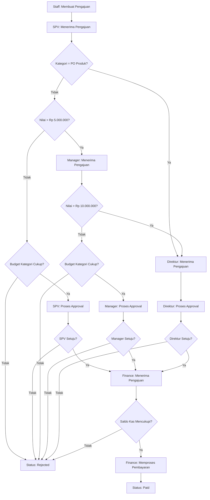
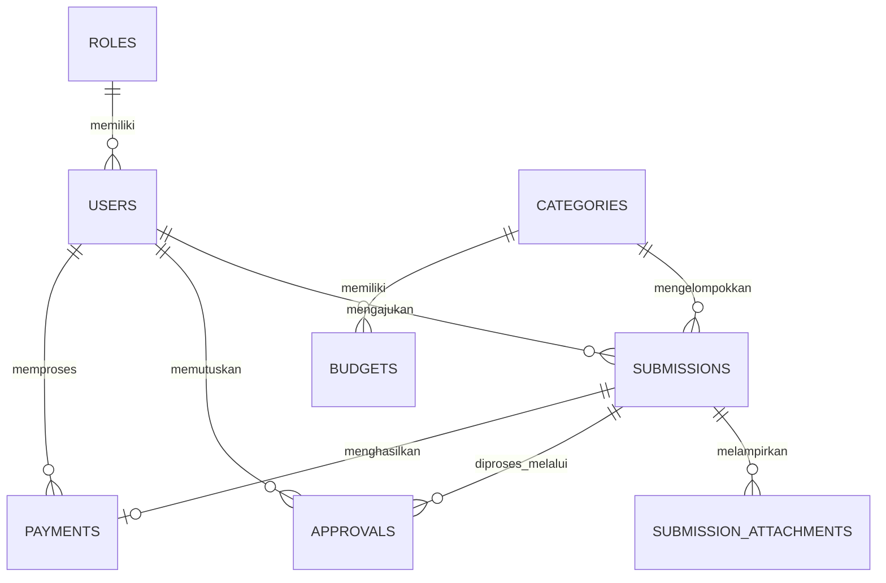

# Product Requirements Document (PRD)
# Sistem Pengajuan Transaksi Pengeluaran

> Dokumen ini disusun berdasarkan hasil analisis terhadap **"Soal Tes Karyawan IT – Web Application Developer"**, termasuk pembacaan detail terhadap diagram alur approval yang dilampirkan. Seluruh aturan bisnis (Kondisi 1–7) pada soal asli dipetakan ulang menjadi kebutuhan produk yang terstruktur agar siap dijadikan acuan pengembangan.

| Atribut | Keterangan |
|---|---|
| Nama Produk | Sistem Pengajuan Transaksi Pengeluaran (Expense Request & Approval System) |
| Jenis Dokumen | Product Requirements Document (PRD) |
| Versi | 1.0 |
| Tanggal Penyusunan | 07 Juli 2026 |
| Sumber Acuan | Soal Tes Karyawan IT – Web Application Developer |
| Status | Draft — siap dipakai sebagai acuan implementasi |

---

## Daftar Isi

1. [Ringkasan Eksekutif](#1-ringkasan-eksekutif)
2. [Latar Belakang & Tujuan](#2-latar-belakang--tujuan)
3. [Ruang Lingkup](#3-ruang-lingkup)
4. [Role Pengguna & Hak Akses (RBAC)](#4-role-pengguna--hak-akses-rbac)
5. [Kebutuhan Fungsional](#5-kebutuhan-fungsional)
6. [Alur Bisnis: Workflow Approval](#6-alur-bisnis-workflow-approval)
7. [Struktur Data Pengajuan](#7-struktur-data-pengajuan)
8. [Status Pengajuan](#8-status-pengajuan)
9. [Desain Database](#9-desain-database)
10. [Kebutuhan Non-Fungsional](#10-kebutuhan-non-fungsional)
11. [Keamanan & Validasi](#11-keamanan--validasi)
12. [Spesifikasi Teknis & Arsitektur](#12-spesifikasi-teknis--arsitektur)
13. [Kebutuhan UI/UX](#13-kebutuhan-uiux)
14. [Fitur Tambahan (Nilai Plus)](#14-fitur-tambahan-nilai-plus)
15. [Kriteria Penerimaan (Acceptance Criteria)](#15-kriteria-penerimaan-acceptance-criteria)
16. [Asumsi & Pertanyaan Terbuka](#16-asumsi--pertanyaan-terbuka)
17. [Risiko & Mitigasi](#17-risiko--mitigasi)
18. [Deliverables & Pengumpulan Hasil](#18-deliverables--pengumpulan-hasil)
19. [Lampiran](#19-lampiran)

---

## 1. Ringkasan Eksekutif

**Sistem Pengajuan Transaksi Pengeluaran** adalah aplikasi web berbasis Laravel yang mendigitalkan proses pengajuan dan persetujuan transaksi pengeluaran perusahaan — menggantikan proses manual (kertas/email/chat) dengan alur kerja terstruktur.

Sistem melibatkan lima role: **Staff** (pengaju), **SPV**, **Manager**, **Direktur** (approver berjenjang), dan **Finance** (eksekutor pembayaran). Yang membuat sistem ini menarik secara teknis adalah **rute approval-nya dinamis** — ditentukan otomatis oleh dua variabel: kategori pengajuan (apakah "PO Produk") dan nilai nominal pengajuan. Sistem harus mampu merutekan pengajuan ke approver yang tepat, memvalidasi ketersediaan budget per kategori, lalu memverifikasi saldo kas sebelum pembayaran dieksekusi oleh Finance.

Fokus penilaian utama (sesuai soal asli) ada pada empat hal: **struktur Laravel, desain database, ketepatan workflow approval, dan RBAC** — sehingga PRD ini memberi porsi pembahasan terbesar pada Bagian 6 (Workflow) dan Bagian 9 (Database).

---

## 2. Latar Belakang & Tujuan

### 2.1 Latar Belakang
Proses pengajuan pengeluaran yang dilakukan secara manual umumnya rawan tiga masalah: (1) tidak ada jejak audit yang jelas siapa menyetujui apa dan kapan, (2) approval bisa "nyangkut" di satu orang tanpa visibilitas status bagi pengaju, dan (3) tidak ada kontrol otomatis terhadap budget per kategori sehingga pengeluaran bisa melebihi anggaran tanpa disadari. Sistem ini dibangun untuk menutup ketiga celah tersebut melalui workflow approval berjenjang yang terkomputerisasi.

### 2.2 Tujuan Produk
- Menyediakan satu pintu pengajuan transaksi pengeluaran yang terintegrasi dengan dokumen pendukung.
- Merutekan approval secara otomatis dan konsisten sesuai kategori & nilai pengajuan, tanpa intervensi manual dalam menentukan siapa yang harus approve.
- Memberi visibilitas status real-time kepada pengaju.
- Mencegah pengajuan disetujui apabila budget kategori terkait tidak mencukupi.
- Memastikan pembayaran hanya diproses Finance setelah seluruh rantai approval selesai **dan** saldo kas mencukupi.
- Menghasilkan jejak audit (siapa approve/reject, kapan, dengan catatan apa) untuk setiap pengajuan.

### 2.3 Konteks Penyusunan
Dokumen ini berasal dari sebuah soal tes teknis untuk posisi **Web Application Developer**, di mana kandidat dinilai dari kemampuan analisis kebutuhan, perancangan database, implementasi Laravel MVC, RBAC, workflow approval, upload dokumen, pengelolaan transaksi database, serta clean code. PRD ini berfungsi ganda: sebagai **spesifikasi produk** sekaligus **peta kerja implementasi** bagi kandidat.

---

## 3. Ruang Lingkup

### 3.1 Dalam Lingkup (In-Scope)
- Autentikasi & otorisasi berbasis role (5 role tetap).
- CRUD pengajuan transaksi pengeluaran oleh Staff, termasuk upload dokumen pendukung.
- Mesin routing approval otomatis berdasarkan kategori & nilai (Kondisi 1–3 pada soal asli).
- Proses approve/reject berjenjang oleh SPV/Manager/Direktur beserta catatan.
- Validasi budget per kategori sebelum approval disetujui pada level SPV/Manager.
- Modul Finance: validasi saldo kas dan eksekusi status "Paid".
- Riwayat & tracking status pengajuan untuk Staff.
- Master data kategori dan budget.

### 3.2 Di Luar Lingkup (Out-of-Scope)
- Integrasi dengan sistem akuntansi/ERP eksternal.
- Multi-currency (asumsi seluruh transaksi dalam Rupiah).
- Aplikasi mobile native (cukup web responsif).
- Pembayaran otomatis ke rekening bank (Finance hanya mengubah status "Paid", eksekusi transfer riil di luar sistem).
- Multi-perusahaan/multi-tenant.
- Approval delegation (pengalihan approval saat approver cuti/tidak tersedia) — dicatat sebagai potensi pengembangan lanjutan, bukan kebutuhan wajib.

---

## 4. Role Pengguna & Hak Akses (RBAC)

| Role | Hak Akses |
|---|---|
| **Staff** | Login · Membuat pengajuan baru · Upload dokumen pendukung · Melihat status pengajuan miliknya · Melihat riwayat pengajuan miliknya |
| **SPV (Supervisor)** | Login · Melihat daftar pengajuan yang masuk ke levelnya · Approve/Reject sesuai workflow · Memberi catatan approval |
| **Manager** | Login · Melihat pengajuan yang memerlukan approval Manager · Approve/Reject · Memberi catatan |
| **Direktur** | Login · Melihat pengajuan yang memerlukan approval Direktur · Approve/Reject · Memberi catatan |
| **Finance** | Login · Melihat transaksi yang sudah lolos seluruh approval · Validasi saldo kas · Memproses pembayaran · Mengubah status menjadi *Paid* |

**Prinsip RBAC:**
- Setiap user memiliki tepat satu role (lihat Bagian 16 untuk asumsi terkait ini).
- Middleware route membatasi akses menu/halaman berdasarkan role — Staff tidak bisa mengakses halaman approval, approver tidak bisa mengakses menu Finance, dst.
- Selain pembatasan menu, dibutuhkan **otorisasi level-objek** (Laravel Gate/Policy): SPV hanya boleh memutuskan pengajuan yang memang berada di levelnya, bukan sekadar "SPV boleh akses halaman approval" — ini penting karena satu pengajuan bisa "melompati" SPV (lihat Bagian 6) sehingga SPV tidak boleh bisa approve pengajuan yang seharusnya bukan haknya.

---

## 5. Kebutuhan Fungsional

### 5.1 Modul Autentikasi & RBAC
| ID | Kebutuhan |
|---|---|
| FR-AUTH-01 | Sistem menyediakan halaman login untuk seluruh role menggunakan Laravel Authentication. |
| FR-AUTH-02 | Sistem membatasi akses menu/halaman berdasarkan role melalui middleware. |
| FR-AUTH-03 | Sistem menyediakan logout dan session management standar Laravel. |
| FR-AUTH-04 | Password disimpan dalam bentuk hash (bcrypt), tidak pernah tersimpan/ditampilkan sebagai plain text. |

### 5.2 Modul Pengajuan (Staff)
| ID | Kebutuhan |
|---|---|
| FR-SUB-01 | Staff dapat membuat pengajuan baru: kategori, tanggal, nilai, deskripsi. |
| FR-SUB-02 | Nomor pengajuan digenerate otomatis oleh sistem dan bersifat unik (lihat format usulan di Bagian 7). |
| FR-SUB-03 | Staff dapat mengunggah dokumen pendukung format PDF/JPG/JPEG/PNG, maksimal 5MB per file. |
| FR-SUB-04 | Staff dapat melihat status pengajuan miliknya secara real-time, termasuk berada di level approval mana saat ini. |
| FR-SUB-05 | Staff dapat melihat riwayat seluruh pengajuan yang pernah dibuat beserta status akhirnya. |
| FR-SUB-06 | Pengajuan hanya dapat diedit selama berstatus *Draft*; setelah *Submitted*, data menjadi read-only bagi Staff. |

### 5.3 Modul Approval (SPV / Manager / Direktur)
| ID | Kebutuhan |
|---|---|
| FR-APR-01 | Sistem menampilkan daftar pengajuan yang membutuhkan approval, khusus untuk level & role approver yang sedang login. |
| FR-APR-02 | Approver dapat membuka detail pengajuan termasuk dokumen lampiran sebelum memutuskan. |
| FR-APR-03 | Approver dapat melakukan Approve atau Reject, disertai kolom catatan (wajib diisi minimal saat Reject). |
| FR-APR-04 | Sistem menentukan rute approval secara otomatis berdasarkan kategori & nilai pengajuan sesuai mesin aturan di Bagian 6 — approver tidak memilih rute secara manual. |
| FR-APR-05 | Sistem mencegah approver memproses pengajuan yang bukan levelnya atau yang sudah diputuskan pihak lain (mencegah double-decision). |
| FR-APR-06 | Setiap keputusan tercatat di tabel `approvals` dengan approver, role, waktu keputusan, dan catatan. |

### 5.4 Modul Finance
| ID | Kebutuhan |
|---|---|
| FR-FIN-01 | Finance dapat melihat daftar pengajuan berstatus *Waiting Finance*. |
| FR-FIN-02 | Finance melakukan validasi saldo kas sebelum memproses pembayaran. |
| FR-FIN-03 | Sistem otomatis mengubah status menjadi *Rejected* jika saldo tidak mencukupi, atau *Paid* jika pembayaran berhasil. |
| FR-FIN-04 | Setiap transaksi pembayaran tercatat di tabel `payments`, termasuk saldo sebelum & sesudah transaksi. |

### 5.5 Modul Master Data
| ID | Kebutuhan |
|---|---|
| FR-ADM-01 | Pengelolaan data kategori pengajuan (CRUD), termasuk penanda kategori "PO Produk" yang memicu rute langsung ke Direktur. |
| FR-ADM-02 | Pengelolaan alokasi budget per kategori per periode. |
| FR-ADM-03 | Sistem memvalidasi sisa budget kategori setiap kali ada pengajuan yang akan diputuskan pada level SPV/Manager. |

---

## 6. Alur Bisnis: Workflow Approval

Ini adalah bagian inti dari sistem (bobot penilaian tertinggi pada soal asli: 25%). Rute approval **tidak tetap** — ia bercabang berdasarkan kategori dan nilai nominal.

### 6.1 Diagram Alur



### 6.2 Tabel Keputusan Routing

Ringkasan dari diagram di atas — siapa approver final untuk tiap kombinasi kondisi:

| # | Kategori | Nilai Pengajuan | Approver Final | Cek Budget Kategori? |
|---|---|---|---|---|
| 1 | PO Produk | Berapa pun | **Direktur** | Tidak — langsung ke diskresi Direktur |
| 2 | Selain PO Produk | ≤ Rp 5.000.000 | **SPV** | Ya |
| 3 | Selain PO Produk | > Rp 5.000.000 s.d. Rp 10.000.000 | **Manager** | Ya |
| 4 | Selain PO Produk | > Rp 10.000.000 | **Direktur** (eskalasi dari Manager) | Tidak — langsung ke diskresi Direktur |

> **Catatan penting:** Berdasarkan diagram, pengecekan budget kategori **hanya** terjadi pada jalur approval SPV dan Manager (baris 2 & 3). Jalur yang berujung ke Direktur (baris 1 & 4) tidak melalui node pengecekan budget — lihat Bagian 16.2 untuk pembahasan asumsi ini.

### 6.3 Aturan Bisnis (Rules)

| Kondisi | Aturan |
|---|---|
| **Kondisi 1** | Jika kategori = PO Produk → langsung menuju approval Direktur. |
| **Kondisi 2** | Jika bukan PO Produk dan nilai > Rp 5.000.000 → rute Staff → SPV → Manager. |
| **Kondisi 3** | Jika nilai > Rp 10.000.000 → setelah sampai di Manager, eskalasi Manager → Direktur. |
| **Kondisi 4** | Jika budget kategori yang diajukan tidak mencukupi → Status = Rejected. |
| **Kondisi 5** | Jika salah satu approver melakukan reject di level mana pun → Status = Rejected. |
| **Kondisi 6** | Jika seluruh approval yang disyaratkan selesai (disetujui) → Status = Waiting Finance. |
| **Kondisi 7** | Finance mengecek saldo kas: cukup → diproses pembayaran (Paid); tidak cukup → Rejected. |

### 6.4 Implikasi Teknis
- Mesin routing sebaiknya diimplementasikan sebagai satu **Service class** (misal `ApprovalRoutingService`) yang dipanggil setiap kali status berubah, bukan tersebar sebagai if-else di banyak Controller — ini langsung menunjang kriteria "Clean Code" (bobot 15%).
- Setiap transisi status + pemotongan/pengembalian budget harus dibungkus dalam **`DB::transaction()`** agar konsisten — ini menjawab langsung requirement asli "Pengelolaan transaksi database".
- Field `current_status` pada `submissions` sebaiknya disinkronkan dengan record terbaru di tabel `approvals`, agar tidak ada dua sumber kebenaran yang bisa berbeda.

---

## 7. Struktur Data Pengajuan

Field minimal formulir pengajuan sesuai soal asli:

| Field | Tipe | Catatan Implementasi |
|---|---|---|
| Nomor Pengajuan | Auto Generate | Usulan format: `PGJ/YYYYMM/0001` (prefix/periode/nomor urut), digenerate saat submit, unik. |
| Tanggal Pengajuan | Date | Default: tanggal hari ini, dapat diedit selama status Draft. |
| Nama Pengaju | Relasi User | Diambil otomatis dari user yang login (`user_id`), bukan input manual. |
| Kategori | Dropdown | Sumber dari master data `categories`. |
| Nilai Pengajuan | Decimal | `DECIMAL(15,2)`, wajib > 0. |
| Deskripsi | Textarea | Wajib diisi, minimal beberapa karakter untuk audit trail yang bermakna. |
| Lampiran Dokumen | File Upload | PDF/JPG/JPEG/PNG, maksimal 5MB; lihat Bagian 11 untuk validasi. |
| Status | Workflow | Lihat daftar lengkap di Bagian 8; tidak diinput manual, murni hasil mesin workflow. |

---

## 8. Status Pengajuan

Status minimal sesuai soal asli, dengan penjelasan transisi:

| Status | Deskripsi |
|---|---|
| **Draft** | Pengajuan dibuat tapi belum disubmit; masih dapat diedit Staff. |
| **Submitted** | Staff telah mengirim pengajuan; siap masuk mesin routing. |
| **Waiting SPV Approval** | Menunggu keputusan SPV (untuk pengajuan ≤ Rp5jt, non-PO Produk). |
| **Waiting Manager Approval** | Menunggu keputusan Manager (untuk pengajuan > Rp5jt s.d. Rp10jt, non-PO Produk). |
| **Waiting Director Approval** | Menunggu keputusan Direktur (untuk kategori PO Produk atau nilai > Rp10jt). |
| **Waiting Finance** | Seluruh approval internal selesai disetujui; menunggu validasi saldo & pembayaran. |
| **Paid** | Finance telah memvalidasi saldo dan memproses pembayaran — status akhir (sukses). |
| **Rejected** | Ditolak oleh salah satu approver, budget tidak cukup, atau saldo kas tidak cukup — status akhir (gagal). |

---

## 9. Desain Database

### 9.1 Entity Relationship Diagram



### 9.2 Rincian Tabel

**`roles`**
| Kolom | Tipe | Keterangan |
|---|---|---|
| id | BIGINT (PK) | |
| name | VARCHAR(50) | Staff, SPV, Manager, Direktur, Finance |
| slug | VARCHAR(50) | staff, spv, manager, direktur, finance — untuk referensi di kode |
| timestamps | | created_at, updated_at |

**`users`**
| Kolom | Tipe | Keterangan |
|---|---|---|
| id | BIGINT (PK) | |
| role_id | BIGINT (FK → roles.id) | |
| name | VARCHAR(100) | |
| email | VARCHAR(100), unique | |
| password | VARCHAR | hashed (bcrypt) |
| phone | VARCHAR(20), nullable | |
| is_active | BOOLEAN, default true | |
| timestamps | | |

**`categories`**
| Kolom | Tipe | Keterangan |
|---|---|---|
| id | BIGINT (PK) | |
| name | VARCHAR(100) | contoh: PO Produk, Operasional, ATK, Perjalanan Dinas |
| code | VARCHAR(20), unique | |
| is_po_produk | BOOLEAN, default false | flag pemicu Kondisi 1 (rute langsung Direktur) |
| is_active | BOOLEAN, default true | |
| timestamps | | |

**`budgets`**
| Kolom | Tipe | Keterangan |
|---|---|---|
| id | BIGINT (PK) | |
| category_id | BIGINT (FK → categories.id) | |
| period | VARCHAR(7) | format `YYYY-MM` |
| allocated_amount | DECIMAL(15,2) | total anggaran periode berjalan |
| used_amount | DECIMAL(15,2), default 0 | akumulasi nilai pengajuan yang sudah lolos approval internal |
| timestamps | | |

> Sisa budget = `allocated_amount - used_amount`, dihitung on-the-fly atau via accessor Eloquent — tidak perlu kolom fisik terpisah agar tidak ada redundansi data.

**`submissions`**
| Kolom | Tipe | Keterangan |
|---|---|---|
| id | BIGINT (PK) | |
| submission_number | VARCHAR(30), unique | auto-generate |
| user_id | BIGINT (FK → users.id) | pengaju |
| category_id | BIGINT (FK → categories.id) | |
| submission_date | DATE | |
| amount | DECIMAL(15,2) | |
| description | TEXT | |
| current_status | VARCHAR(30) | salah satu dari 8 status di Bagian 8 |
| rejection_reason | TEXT, nullable | diisi saat status = Rejected |
| timestamps | | |

**`submission_attachments`**
| Kolom | Tipe | Keterangan |
|---|---|---|
| id | BIGINT (PK) | |
| submission_id | BIGINT (FK → submissions.id) | |
| file_name | VARCHAR(255) | nama asli file |
| file_path | VARCHAR(255) | path relatif di Laravel Storage |
| file_type | VARCHAR(10) | pdf / jpg / jpeg / png |
| file_size | INTEGER | dalam KB |
| created_at | | |

**`approvals`**
| Kolom | Tipe | Keterangan |
|---|---|---|
| id | BIGINT (PK) | |
| submission_id | BIGINT (FK → submissions.id) | |
| approver_id | BIGINT (FK → users.id), nullable | terisi setelah diputuskan |
| role_id | BIGINT (FK → roles.id) | level approval: SPV/Manager/Direktur |
| sequence | TINYINT | urutan approval (1, 2, 3) |
| decision | VARCHAR(20) | Pending / Approved / Rejected |
| notes | TEXT, nullable | catatan approval |
| decided_at | TIMESTAMP, nullable | |
| timestamps | | |

**`payments`**
| Kolom | Tipe | Keterangan |
|---|---|---|
| id | BIGINT (PK) | |
| submission_id | BIGINT (FK → submissions.id), unique | |
| processed_by | BIGINT (FK → users.id) | staff Finance yang memproses |
| amount | DECIMAL(15,2) | |
| balance_before | DECIMAL(15,2) | saldo kas sebelum transaksi |
| balance_after | DECIMAL(15,2) | saldo kas sesudah transaksi |
| status | VARCHAR(20) | Processed / Insufficient Balance |
| paid_at | TIMESTAMP, nullable | |
| timestamps | | |

### 9.3 Penjelasan Relasi Antar Tabel
- **roles → users** (1:N): satu role dimiliki banyak user; satu user memiliki tepat satu role.
- **users → submissions** (1:N): satu user (sebagai Staff/pengaju) dapat membuat banyak pengajuan.
- **categories → submissions** (1:N): satu kategori mengelompokkan banyak pengajuan.
- **categories → budgets** (1:N): satu kategori memiliki banyak record budget (satu per periode).
- **submissions → submission_attachments** (1:N): satu pengajuan dapat memiliki banyak lampiran (mendukung fitur plus "Multi file upload").
- **submissions → approvals** (1:N): satu pengajuan menghasilkan satu record approval untuk setiap level yang dilaluinya (bukan satu record untuk seluruh proses).
- **users → approvals** (1:N): satu user (sebagai approver) memberikan banyak keputusan approval sepanjang waktu.
- **submissions → payments** (1:1): satu pengajuan menghasilkan maksimal satu record pembayaran.
- **users → payments** (1:N): satu user Finance dapat memproses banyak pembayaran.

---

## 10. Kebutuhan Non-Fungsional

| ID | Kategori | Kebutuhan |
|---|---|---|
| NFR-01 | Security | Password bcrypt, CSRF protection bawaan Blade, middleware role-based, Policy/Gate untuk otorisasi level-objek. |
| NFR-02 | Performance | Pagination pada semua listing data; index database pada kolom `current_status`, `user_id`, `category_id` yang sering difilter. |
| NFR-03 | Reliability | Operasi yang mengubah status + budget dibungkus `DB::transaction()` agar atomik dan konsisten (langsung menjawab requirement "pengelolaan transaksi database" pada soal asli). |
| NFR-04 | Usability | UI responsif Bootstrap 5, status pengajuan ditampilkan dengan badge warna yang konsisten di seluruh halaman. |
| NFR-05 | Maintainability | Struktur MVC bersih, validasi lewat Form Request, penamaan mengikuti konvensi Laravel, logika routing approval terpusat di satu Service class. |
| NFR-06 | Compatibility | Berjalan baik di browser modern (Chrome, Firefox, Edge terbaru); deployment standar Apache/Nginx + PHP-FPM + MySQL. |
| NFR-07 | Auditability | Setiap keputusan approval & transaksi pembayaran tersimpan permanen dengan timestamp dan pelaku — dasar untuk fitur plus Activity Log/Audit Trail. |

---

## 11. Keamanan & Validasi

- **Validasi upload dokumen:** tipe file divalidasi berdasarkan MIME type asli (bukan hanya ekstensi nama file), dibatasi PDF/JPG/JPEG/PNG, maksimal 5MB — gunakan Form Request Laravel dengan rule `mimes:pdf,jpg,jpeg,png|max:5120`.
- **Penyimpanan file:** menggunakan Laravel Storage (disk `local` dengan symbolic link `storage:link`, atau disk cloud jika tersedia), nama file di-hash/random agar tidak predictable dan tidak menimpa file lain.
- **Validasi input server-side:** seluruh form (pengajuan, approval, master data) tervalidasi di server melalui Form Request, tidak mengandalkan validasi client-side saja.
- **Otorisasi berlapis:** middleware membatasi akses route per role; Policy/Gate memastikan approver hanya bisa memutuskan pengajuan yang benar levelnya dan belum diputuskan pihak lain.
- **Proteksi CSRF:** token `@csrf` bawaan Laravel pada seluruh form.
- **Mencegah race condition pada budget:** saat proses approval yang memotong budget kategori, gunakan row locking (`lockForUpdate()`) di dalam `DB::transaction()` agar dua approval bersamaan pada kategori yang sama tidak membuat perhitungan budget salah.
- **SQL Injection & XSS:** penggunaan Eloquent ORM/Query Builder (bukan raw query) dan Blade templating (auto-escape `{{ }}`) sebagai baseline proteksi.

---

## 12. Spesifikasi Teknis & Arsitektur

| Komponen | Pilihan | Catatan |
|---|---|---|
| Framework | Laravel — versi stabil terbaru | Per Juli 2026, versi stabil terbaru adalah **Laravel 13.x** (rilis Maret 2026, minimum PHP 8.3). Laravel 12.x juga masih menerima bug fix hingga Agustus 2026 dan bisa jadi pilihan lebih konservatif. Sebaiknya cek [laravel.com/docs](https://laravel.com/docs) untuk memastikan versi terbaru saat pengerjaan dimulai. |
| Database | MySQL | Gunakan migration Laravel untuk seluruh skema, jangan buat tabel manual di luar migration. |
| Frontend | Bootstrap 5, HTML5, CSS3, JavaScript (opsional) | |
| Autentikasi | Laravel Breeze / Laravel UI / Jetstream | **Pertimbangan penting:** Breeze dan Jetstream secara default menggunakan Tailwind CSS untuk scaffolding, sedangkan requirement mewajibkan Bootstrap 5. Paket **Laravel UI** menyediakan scaffolding auth berbasis Bootstrap secara native, sehingga lebih cocok dipakai langsung tanpa perlu konversi Tailwind → Bootstrap. Alternatif lain: pakai Breeze untuk struktur route/controller-nya lalu ganti view secara manual ke Bootstrap 5 — Laravel bahkan menyediakan `Paginator::useBootstrapFive()` bawaan untuk komponen paginasi. |
| Arsitektur | MVC (Model-View-Controller) | Tambahkan **Service layer** khusus untuk logika routing approval (lihat 6.4) agar Controller tetap ramping. |
| Source Control | Git + GitHub | Commit history sebaiknya granular (per fitur/modul), bukan satu commit besar di akhir. |

---

## 13. Kebutuhan UI/UX

- Dashboard berbeda per role: Staff melihat ringkasan pengajuannya sendiri; approver (SPV/Manager/Direktur) melihat antrian yang perlu diputuskan; Finance melihat antrian *Waiting Finance*.
- Badge/label warna konsisten untuk tiap status (misal: abu-abu untuk Draft, kuning untuk status Waiting, hijau untuk Paid, merah untuk Rejected).
- Form pengajuan menampilkan validasi error secara jelas per field (Bootstrap `is-invalid` + `invalid-feedback`).
- Halaman detail pengajuan menampilkan **timeline approval** (riwayat siapa approve/reject, kapan, catatannya) — memudahkan audit visual sekaligus nice-to-have yang murah diimplementasikan karena datanya sudah ada di tabel `approvals`.
- Layout responsif menggunakan grid Bootstrap 5, dapat diakses baik dari desktop maupun tablet/mobile.
- Preview dokumen lampiran (gambar ditampilkan langsung, PDF dengan link unduh/preview).

---

## 14. Fitur Tambahan (Nilai Plus)

Sesuai soal asli, implementasi minimal satu atau lebih dari daftar berikut akan menambah nilai:

| Fitur | Kompleksitas Estimasi | Catatan Implementasi |
|---|---|---|
| Dashboard statistik | Sedang | Grafik jumlah pengajuan per status, total nilai per kategori, dsb — bisa pakai Chart.js. |
| Activity log | Rendah–Sedang | Tabel `activity_logs` (user_id, action, description, ip_address, created_at) atau pakai package `spatie/laravel-activitylog`. |
| Email notification | Sedang | Laravel Notification/Mailable — trigger saat pengajuan masuk ke approver baru atau status berubah. |
| Export PDF | Sedang | `barryvdh/laravel-dompdf` untuk cetak detail pengajuan/laporan. |
| Export Excel | Sedang | `maatwebsite/excel` untuk laporan rekap pengajuan. |
| Audit trail | Rendah–Sedang | Bisa memanfaatkan data yang sudah ada di `approvals` + `activity_logs`, tampilkan sebagai laporan. |
| Multi file upload | Rendah | Sudah didukung desain tabel `submission_attachments` di Bagian 9 — tinggal ubah input file jadi `multiple`. |
| API endpoint | Sedang–Tinggi | Laravel Sanctum untuk expose endpoint status pengajuan (misal untuk integrasi mobile di masa depan). |

**Rekomendasi prioritas** (mengingat timeline pengerjaan singkat, lihat Bagian 17): pilih 1–2 fitur dengan kompleksitas rendah–sedang yang paling menonjolkan kerapian kode, misalnya **Activity Log** dan **Multi file upload**, karena keduanya sudah selaras dengan desain database yang diusulkan tanpa banyak dependency tambahan.

---

## 15. Kriteria Penerimaan (Acceptance Criteria)

Dipetakan langsung dari bobot penilaian pada soal asli:

| Aspek | Bobot | Kriteria Penerimaan |
|---|---|---|
| Struktur Laravel | 20% | Mengikuti konvensi MVC Laravel standar; folder/namespace terorganisir; migration & seeder lengkap dan dapat dijalankan tanpa error dari kondisi fresh install. |
| Database Design | 15% | Seluruh tabel minimal (Bagian 9) terimplementasi dengan relasi FK yang benar; tidak ada redundansi data; dijelaskan dalam dokumentasi. |
| Workflow Approval | 25% | Seluruh 7 kondisi pada Bagian 6.3 berjalan sesuai diagram, termasuk edge case (PO Produk, eskalasi >10jt, budget tidak cukup, saldo tidak cukup). |
| Clean Code | 15% | Logika bisnis tidak bertumpuk di Controller; penamaan konsisten; tidak ada duplikasi kode signifikan. |
| UI/UX Bootstrap | 10% | Seluruh halaman menggunakan Bootstrap 5, responsif, konsisten antar role. |
| Security & Validation | 10% | Validasi server-side lengkap di setiap form; upload file tervalidasi tipe & ukuran; middleware role-based aktif di seluruh route yang relevan. |
| Dokumentasi | 5% | README.md lengkap: instalasi, cara menjalankan, struktur database, akun login testing. |

---

## 16. Asumsi & Pertanyaan Terbuka

Bagian ini penting karena soal asli tidak secara eksplisit menjawab beberapa hal berikut. Asumsi di bawah diambil demi kelengkapan PRD, namun idealnya dikonfirmasi ke pemberi kerja/stakeholder sebelum implementasi final.

1. **Format nomor pengajuan** tidak dispesifikasikan → diasumsikan format `PGJ/YYYYMM/0001`.
2. **Budget check tidak muncul di jalur Direktur.** Diagram tidak menampilkan node pengecekan budget sebelum approval Direktur (baik dari kategori PO Produk maupun eskalasi nilai >Rp10jt) → diasumsikan approval Direktur bersifat diskresi penuh tanpa validasi budget otomatis. Ini layak dikonfirmasi karena cukup signifikan secara bisnis (nilai pengajuan terbesar justru tidak melalui kontrol budget otomatis).
3. **"Saldo Mencukupi" di tahap Finance** diasumsikan merujuk pada saldo kas/rekening perusahaan secara keseluruhan — konsep yang berbeda dari "Budget Kategori" yang dicek di tahap SPV/Manager. Disarankan ada tabel/nilai terpisah untuk saldo kas (bisa sesederhana satu baris konfigurasi, atau dihitung dari akumulasi tabel `payments`).
4. **Kategori selain "PO Produk"** tidak disebutkan eksplisit → diasumsikan berupa master data bebas-kelola, contoh: Operasional, ATK, Perjalanan Dinas, Marketing.
5. **Satu user = satu role**, bukan multi-role, untuk kesederhanaan MVP sesuai lima akun testing yang diminta.
6. **Mata uang tunggal Rupiah**, tidak ada kebutuhan multi-currency.
7. **Reversal budget saat ditolak Finance:** jika Finance menolak karena saldo kas tidak cukup (Kondisi 7), apakah `used_amount` pada budget kategori yang sudah terlanjur bertambah saat approval internal perlu dikembalikan agar kategori tersebut bisa menerima pengajuan lain? Soal asli tidak membahas ini — direkomendasikan **ya, dikembalikan**, agar penolakan di tahap akhir tidak "mengunci" budget kategori secara permanen.
8. **Edit/pembatalan pengajuan** hanya dimungkinkan selama status Draft; setelah Submitted, pengajuan bersifat read-only bagi Staff (tidak ada requirement eksplisit soal pembatalan pengajuan yang sudah berjalan).

---

## 17. Risiko & Mitigasi

| Risiko | Dampak | Mitigasi |
|---|---|---|
| Workflow bercabang (kategori × nilai × budget) rawan bug pada edge case | Tinggi — inilah komponen berbobot terbesar (25%) | Buat unit test untuk setiap kombinasi kondisi di Bagian 6.2 (minimal 4 skenario utama + 3 skenario reject). |
| Race condition saat dua approval memotong budget kategori yang sama secara bersamaan | Sedang | Gunakan `DB::transaction()` + `lockForUpdate()` saat proses approval yang mengubah `used_amount`. |
| File upload berbahaya disamarkan sebagai dokumen sah | Sedang | Validasi MIME type asli, simpan file di luar direktori yang bisa dieksekusi langsung. |
| Timeline pengerjaan singkat (3–5 hari kalender) untuk scope yang cukup besar | Tinggi | Prioritaskan Workflow Approval (25%) dan Struktur Laravel (20%) lebih dulu; fitur tambahan (Bagian 14) dikerjakan hanya jika waktu tersisa. |
| Ambiguitas pada Bagian 16 disalahartikan berbeda dari ekspektasi penilai | Sedang | Cantumkan asumsi yang diambil secara eksplisit di README.md agar penilai memahami keputusan desain yang diambil. |

---

## 18. Deliverables & Pengumpulan Hasil

### 18.1 Source Code
Diunggah ke GitHub Repository, wajib berisi:
- Source code lengkap
- Database migration
- Seeder (termasuk 5 akun testing, satu per role)
- README.md

### 18.2 Isi README.md
- Cara instalasi
- Cara menjalankan project
- Struktur database
- Akun login testing, format:

```
Staff      : staff@test.com     / password
SPV        : spv@test.com       / password
Manager    : manager@test.com   / password
Direktur   : direktur@test.com  / password
Finance    : finance@test.com   / password
```

### 18.3 Pengiriman Hasil
Dikirim ke **julian.chand@gmail.com** dengan subjek **"Tes IT Developer - [Nama Kandidat]"**, berisi:
- URL GitHub Repository
- Nama lengkap
- Nomor telepon

### 18.4 Batas Waktu
Maksimal **3–5 hari kalender** sejak soal diterima.

---

## 19. Lampiran

### 19.1 Glosarium
| Istilah | Arti |
|---|---|
| PO Produk | Kategori pengajuan yang secara otomatis dirutekan langsung ke approval Direktur, melewati SPV/Manager. |
| RBAC | Role Based Access Control — pembatasan akses sistem berdasarkan peran pengguna. |
| Approver | Sebutan umum untuk SPV, Manager, atau Direktur pada konteks memutuskan approve/reject. |
| Saldo | Merujuk pada saldo kas perusahaan yang divalidasi Finance, bukan budget kategori. |

### 19.2 Ringkasan Teknologi Wajib
Laravel (terbaru stabil) · MySQL · Bootstrap 5 · HTML5 · CSS3 · JavaScript (opsional) · Laravel Authentication (Breeze/Laravel UI/Jetstream) · Git · GitHub

### 19.3 Referensi
Dokumen ini disusun berdasarkan berkas **"SOAL TES KARYAWAN IT – WEB APPLICATION DEVELOPER"** yang diunggah pengguna, termasuk diagram alur *"PENGAJUAN TRANSAKSI PENGELUARAN"* di dalamnya.

---

*Akhir Dokumen — PRD v1.0*
